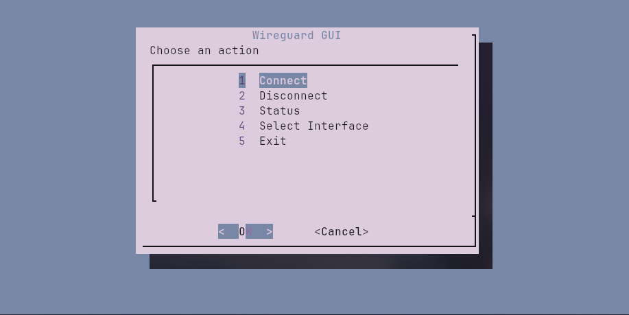
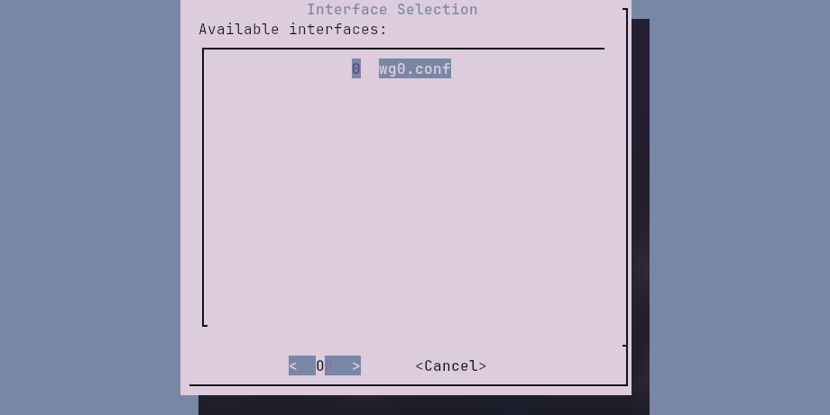
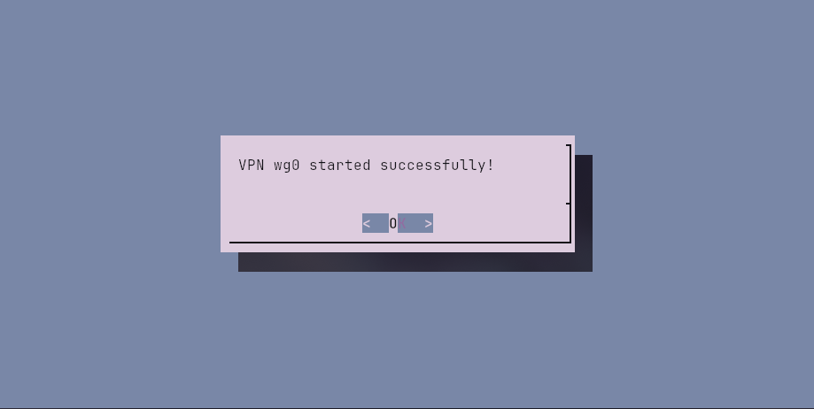

# WireGuard GUI
This script provides a convenient text interface for managing VPN connections via WireGuard. 
The program supports selecting configuration files, managing connections and statuses, 
and saving the last selected interface.
- - -
## Preview





- - -
## Features
- Select a primary VPN interface from the list.
- Add a new interface by specifying the path to the configuration file.
- Delete an existing interface.
- Start and stop the selected interface.
- Display the status of the active interface.
- Automatically save the last selected interface.
## Requirements
- WireGuard installed.
- The `dialog` utility for displaying the text interface.
- - -
## Installation and Setup
1. Copy the script to the desired directory.
2. Ensure the script has execution permissions:
    ```bash
    chmod +x /home/user/Scripts/wireguardGuiTools.sh
    ```

## Usage
Run the script from the terminal:

```bash
bash /example/path/wireguardGui.sh
```

Upon launch, you will be prompted to enter the `sudo` password for performing administrative operations.

### Example Configuration for a Popup Window:
```bash
#!/bin/bash
hyprctl keyword windowrulev2 "float, class:kitty, title:(VPN)"

kitty --hold --title "VPN" -e bash -c "
sh /example/path/wireguardGui.sh
"
```

### Note
This example is suitable only for those using Hyprland as a window manager and Kitty as a terminal.

## Interface Example
The program provides a text menu to perform the following actions:
1. Connect to the VPN.
2. Disconnect from the VPN.
3. View the status of the current interface.
4. Select or add a new interface.
5. Exit the program.

When a primary interface is selected, it will be automatically saved for future use.
